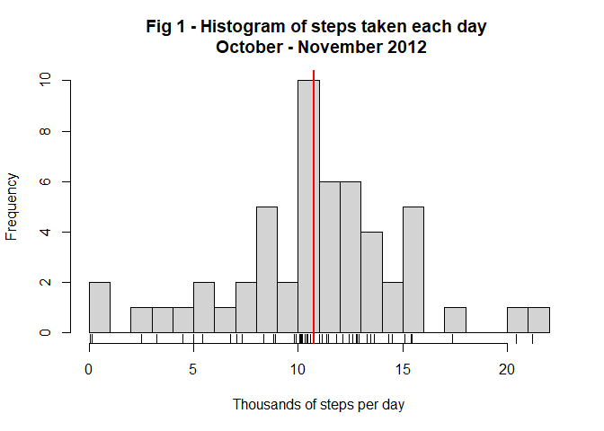
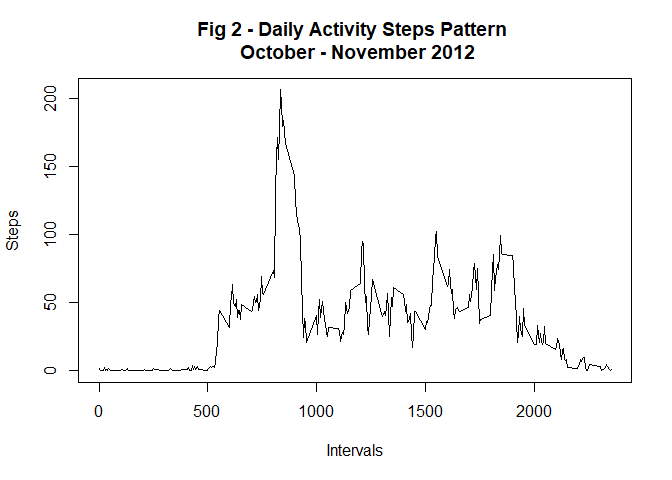
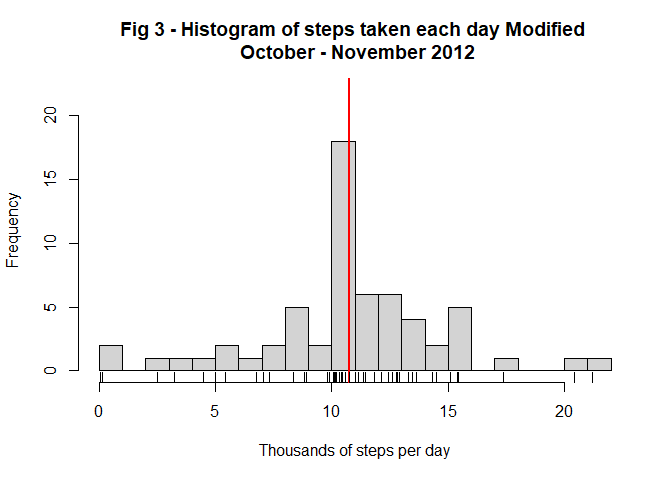
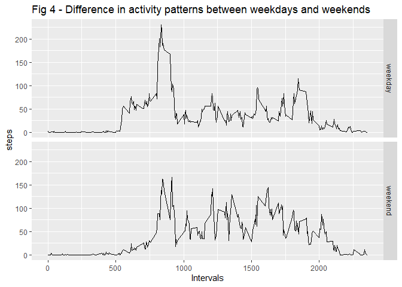

## Loading and preprocessing the data

We read the *activity.csv* file from the working directory and convert the *date*
variable from char to date format.
 

```r
activity <- read.csv("activity.csv", header = TRUE)
activity$date <- as.Date(activity$date, format = "%Y-%m-%d")
```
  
## What is mean total number of steps taken per day?

Now, we calculate the steps taken each day using the *aggregate* function. The NA values
are ignored by default.


```r
steps_day <- aggregate(steps ~ date, data = activity, FUN = sum)
names(steps_day) <- c("date", "steps")
```

We calculate the mean and the median of steps per day. We apply the *summary* 
function to the steps per day to compare the results. 


```r
mean_steps <- mean(steps_day$steps, na.rm = TRUE)
median_steps <- median(steps_day$steps, na.rm = TRUE) 

summary(steps_day$steps)
```

```
##    Min. 1st Qu.  Median    Mean 3rd Qu.    Max. 
##      41    8841   10765   10766   13294   21194
```

As seen, the mean of steps per day is **10766**, the median is **10765**.

With the calculated figures, we generate in Fig. 1 a histogram of the steps taken per day. The vertical
red line shows the mean and the median that are basically the same.


```r
hist(steps_day$steps/10^3, breaks = 25,
     main = "Fig. 1 - Histogram of steps taken each day \n October - November 2012",
     xlab = "Thousands of steps per day")
rug(steps_day$steps/10^3)
abline(v = mean_steps/10^3, col = "red", lwd = 2)
```

<!-- -->


## What is the average daily activity pattern?

To show a daily activity pattern, Fig.2 contains a time series plot of the 5-minute
interval and the average number of steps taken, averaged across all days.


```r
## Calculate average steps per interval
steps_interval = aggregate(steps ~ interval, data = activity, FUN = mean)
names(steps_interval) <- c("interval", "steps")

## Plot the graph
plot(steps_interval$interval, steps_interval$steps, 
     type = "l",
     main = "Fig. 2 - Daily Activity Steps Pattern \n October - November 2012",
     xlab = "Intervals",
     ylab = "Steps")
```

<!-- -->

We calculate and print now the interval with the maximum average of steps and the corresponding average.


```r
index_interval_max = which.max(steps_interval$steps)

sprintf("Interval with maximum average of steps = %i with an average of steps = %g",
        steps_interval$interval[index_interval_max],
        steps_interval$steps[index_interval_max])
```

```
## [1] "Interval with maximum average of steps = 835 with an average of steps = 206.17"
```

## Imputing missing values

Let's see how many *steps* have NA values in the original *activity* data frame.


```r
sum(is.na(activity$steps)) 
```

```
## [1] 2304
```

We will replace these NA values with the mean for the corresponding 5-minute 
interval calculated above and shown in Fig. 2. To preserve the original *activity*
data set, we will create a new one called *activity_mod* for the replacement of
the missing values.


```r
activity_mod <- activity
NA_indexes <- which(is.na(activity_mod$steps)) 
for (i in NA_indexes) {
        activity_mod$steps[i] = steps_interval[
          steps_interval$interval == activity_mod$interval[i],]$steps
}
```

Let's calculate the new mean and median of steps per day.


```r
steps_day_mod <- aggregate(steps ~ date, data = activity_mod, FUN = sum)
names(steps_day_mod) <- c("date", "steps")

mean_steps_mod <- mean(steps_day_mod$steps)
mean_steps_mod
```

```
## [1] 10766.19
```

```r
median_steps_mod <- median(steps_day_mod$steps) 
median_steps_mod
```

```
## [1] 10766.19
```

After replacing the NA values, the total steps in the period went from 
**570608** to **656737.5**.
However, the mean and the median steps per day remained basically the same as before around 
**10766.19**.

Fig. 3 shows the new histogram of steps per day after replacing NA values. 
This histogram can be compared with the one in FIg. 1. Again, the red line shows
the mean and the median.


```r
hist(steps_day_mod$steps/10^3, breaks = 25,
     main = "Fig. 3 - Histogram of steps taken each day Modified \n October - November 2012",
     xlab = "Thousands of steps per day",
     ylim = c(0, 22))
abline(v = mean_steps_mod/10^3, col = "red", lwd = 2)
rug(steps_day_mod$steps/10^3)
```

<!-- -->

## Are there differences in activity patterns between weekdays and weekends?

to solve this question, we create a new factor in the modified *activity_mod* 
data frame for 'weekday' or 'weekend'.


```r
weekend_days = c("Saturday", "Sunday")
activity_wend <- weekdays(activity_mod$date) %in% weekend_days
activity_mod$day[activity_wend] <- "weekend"
activity_mod$day[!activity_wend] <- "weekday"
activity_mod$day <- factor(activity_mod$day, labels = c("weekday", "weekend"))
```

We compute now the steps average by day type ("weekday" and "weekend") and by 
interval.


```r
steps_daytype <- aggregate(activity_mod$steps,
                           by = list(activity_mod$day, activity_mod$interval),
                           FUN = mean)
names(steps_daytype) <- c("day", "interval", "steps")
```

Finally, we plot the differences in activity patterns between weekdays and weekends.


```r
library(ggplot2)
mygraph_title = "Fig 4 - Differences in activity patterns between weekdays and weekends"
graph <- ggplot(steps_daytype, aes(interval, steps)) 
graph <- graph + geom_line() + facet_grid(day ~ .)
graph <- graph + ggtitle(mygraph_title) +
         xlab("Intervals")
plot(graph)
```

<!-- -->
